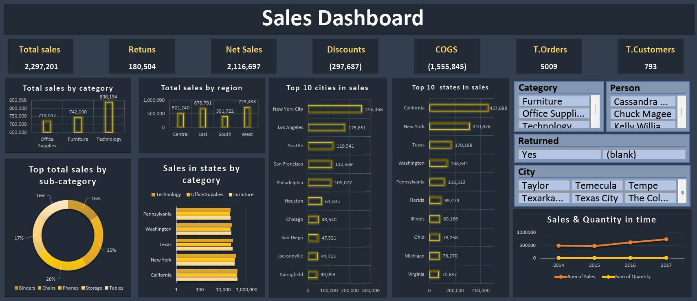

Dashboard Overview
This dashboard provides a comprehensive overview of sales performance, customer behavior, and product trends. It offers valuable insights for businesses to analyze sales data, identify top-performing products and regions, and track customer satisfaction.

Key Metrics and Visualizations
Total Sales: A numeric value displays the total sales amount.
Returns: A numeric value shows the total returns.
Net Sales: A numeric value represents the net sales after deducting returns.
Discounts: A numeric value indicates the total discounts applied.
COGS: A numeric value represents the cost of goods sold.
Total Orders: A numeric value shows the total number of orders.
Total Customers: A numeric value indicates the total number of customers.
Total Sales by Category: A bar chart compares sales across different product categories.
Total Sales by Region: A bar chart illustrates sales performance in different regions.
Top 10 Cities in Sales: A bar chart ranks cities based on sales volume.
Top 10 States in Sales: A bar chart ranks states based on sales volume.
Top Total Sales by Sub-Category: A pie chart shows the distribution of sales among sub-categories.
Sales in States by Category: A bar chart compares sales of different categories within each state.
Sales & Quantity in Time: A line chart illustrates sales and quantity trends over time (2014-2017).
Insights and Potential Use Cases
Sales Performance: Analyze overall sales trends, identify top-selling products, and assess the impact of discounts and returns.
Customer Behavior: Understand customer preferences and purchasing patterns based on sales data.
Product Performance: Identify high-performing and low-performing products to optimize inventory and marketing efforts.
Regional Analysis: Assess sales performance in different regions to identify growth opportunities and address challenges.
Operational Efficiency: Analyze sales and quantity trends to identify areas for improvement in inventory management and order fulfillment.
By leveraging this dashboard, businesses can make data-driven decisions to improve sales, enhance customer satisfaction, and optimize operations.
